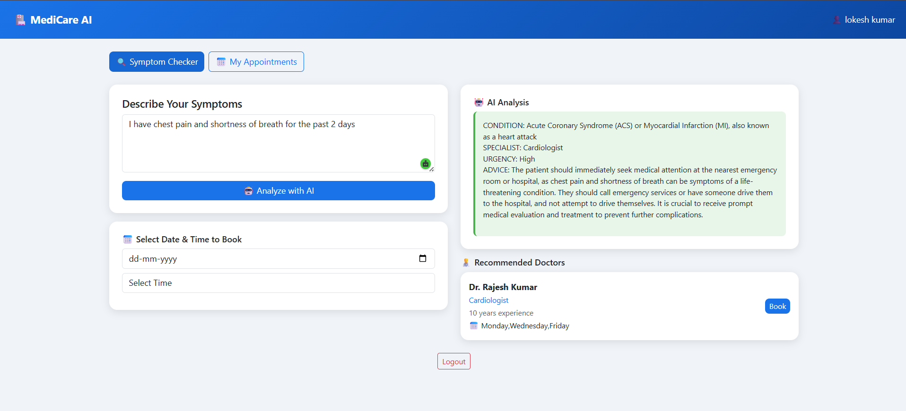
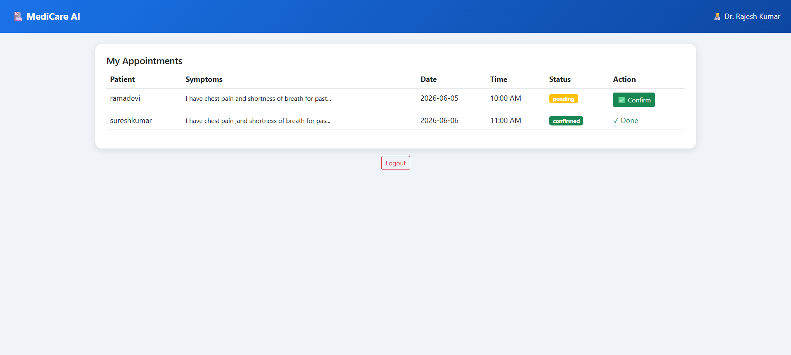

# 🏥 AI Doctor Appointment System

An AI-powered full stack web application that analyzes patient symptoms and recommends specialist doctors for appointments.

## 🔍 Features
- AI symptom analysis using Groq LLaMA 3.3
- Specialist doctor recommendation
- Appointment booking system
- Three role dashboards — Patient, Doctor, Admin
- Doctor can confirm appointments
- JWT authentication

## 🛠️ Tech Stack
- **Frontend:** React, Bootstrap
- **Backend:** Flask, REST API
- **Database:** SQLite
- **AI:** Groq API (LLaMA 3.3 70B)
- **Auth:** JWT Tokens

## 🚀 How to Run
1. Clone the repo
2. Install: `pip install -r requirements.txt`
3. Add `.env` file with `GROQ_API_KEY=your_key`
4. Run: `python app.py`
5. Open: `http://localhost:5000`

## 📸 Screenshots

### Patient Dashboard — AI Symptom Checker

### Doctor Dashboard — Appointment Management
